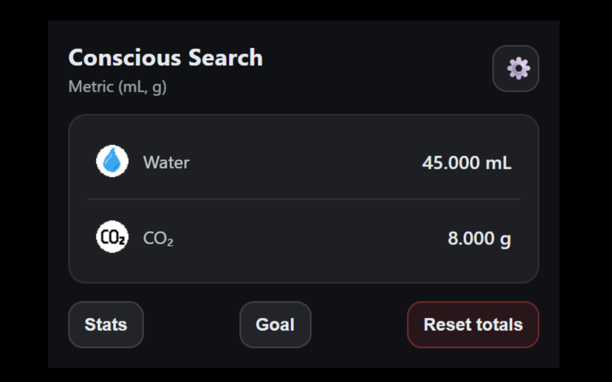
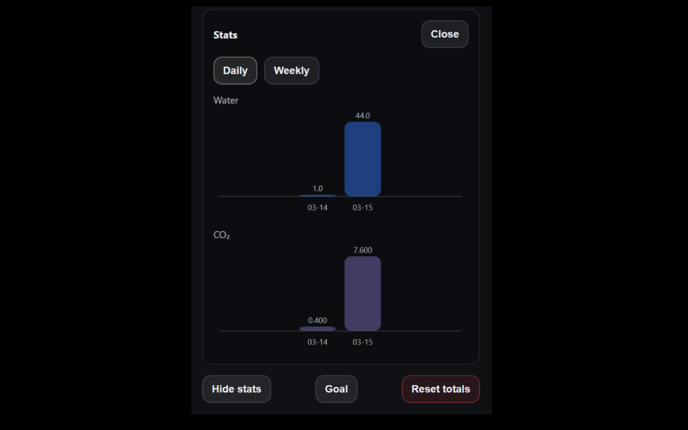
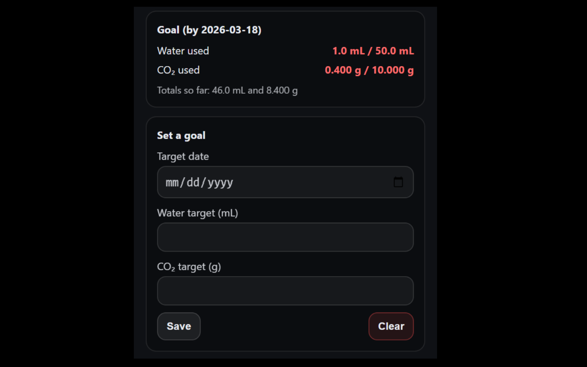

# Conscious Search

Conscious Search is a Chrome extension that estimates the environmental impact of supported online searches by tracking estimated water usage and CO₂ emissions locally in the browser.

## Features

- Estimates water usage and CO₂ emissions for supported searches
- Tracks running totals locally in the browser
- Displays daily and weekly statistics with charts
- Supports optional goals and progress tracking
- Provides metric and US unit conversions
- Does not collect or transmit search queries or browsing data

## Privacy

All calculations are performed locally in the browser. No search queries or browsing data are collected, stored remotely, or transmitted.

## Disclaimer

Environmental impact values are estimates based on publicly available research and approximations. They are intended for awareness and educational purposes only.

## Tech Stack

TypeScript, React, Chrome Extensions API, Vite

## Architecture

The extension uses:
- React for the UI
- Chrome Extensions API for browser integration
- Local browser storage for persistence
- TypeScript for type-safe frontend logic

All calculations and tracking are performed locally in the browser.

## Screenshots

### Popup Interface


### Statistics Dashboard


### Goal Dashboard


## Installation

Install from the Chrome Web Store: [Conscious Search](https://chromewebstore.google.com/detail/conscious-search/khflbchppnjjhckmimibnjdcikbecloh?authuser=0&hl=en)

For local development:

```bash
npm install
npm run build

Then load the dist folder as an unpacked extension in Chrome.
